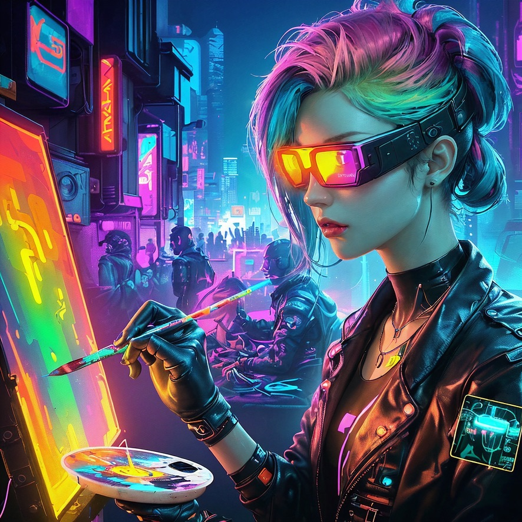

MLX Stable Diffusion WebUI
====================================
This is a straightforward web interface for the Apple MLX Stable Diffusion example.

It is a modified version of mlx-examples/stable-diffusion by Apple. The original code can be found at https://github.com/ml-explore/mlx-examples/tree/main/stable_diffusion

The project is purely for educational purposes and is not intended for any serious use.

Depending on the availability of free time and the level of interest, there may be further development and refinement of these ideas.

What's New
=============

👉 Streamlit WebUI

👉 Models: 
  
    Stable-diffusion-2-1-base

    Dreamshaper-8

    Absolute-reality-1.81

👉 Crude Implementation of Image to Image Generation

Installation
=============

To run this example, you need to install Streamlit. 

    pip install streamlit   

Alternatively, you can install it using:

    pip install -r requirements.txt

The first time you run the code with a new checkpoint, it will download it from Hugging Face, so it may take a while. Downloded checkpoints are cached, so the next time you run the code it will be faster.

How to Add Models from Hugging Face
===================================

To add a new model, you need to add a new entry to the _AVAILABLE_MODELS list in `stable_diffusion_models.py`. For example, to add the `Lykon/absolute-reality-1.81` model, you would add the following entry:

    _AVAILABLE_MODELS = [
        "stabilityai/stable-diffusion-2-1-base",
        "Lykon/dreamshaper-8",
        "Lykon/absolute-reality-1.81", # <--- Add this line
    ]

Added models will be available in the dropdown menu in the web interface automatically. XL models are not supported. 

How to Run
=============
To run the example, simply type in terminal:

    streamlit run ./MLX-Stable-Diffusion-WebUI/main.py
